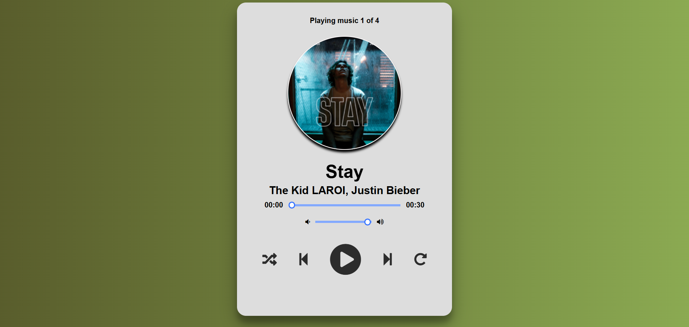

# 🎵 Music Player

A modern and responsive **Music Player** built using **HTML, CSS, and JavaScript**. This project provides an intuitive user interface with essential music playback controls, making it easy to enjoy your favorite songs directly in the browser.

---

## 📖 Overview

The Music Player is a front-end web application that allows users to play, pause, skip tracks, control volume, and navigate through a playlist. It features a clean and responsive design that works seamlessly across desktops, tablets, and mobile devices.

This project was developed as part of the **CodeAlpha Frontend Development Internship**.

---

## ✨ Features

- ▶️ Play and Pause music
- ⏮️ Previous Track
- ⏭️ Next Track
- 📜 Playlist Support
- 🎵 Display Song Title & Artist
- ⏱️ Song Duration Display
- 📊 Interactive Progress Bar
- 🔊 Volume Control
- 📱 Responsive Design
- 🎨 Smooth Animations & Hover Effects
- ⚡ Fast and Lightweight

---

## 🛠️ Technologies Used

- HTML5
- CSS3
- JavaScript (ES6)

---

## 📂 Project Structure

```
Music-Player/
│── index.html
│── style.css
│── script.js
│── README.md
│── images
│── music
```

---

## 📸 Screenshots

### Home Screen



---
### open the repository
https://shambhavi-110.github.io/Music-Player/

---

## 🎮 Controls

| Button | Function |
|---------|----------|
| ▶️ | Play Music |
| ⏸️ | Pause Music |
| ⏮️ | Previous Song |
| ⏭️ | Next Song |
| 📊 | Seek Music |
| 🔊 | Adjust Volume |

---

## 📚 Learning Outcomes

Through this project, I strengthened my understanding of:

- DOM Manipulation
- Event Handling
- Responsive Web Design
- CSS Animations
- UI/UX Design Principles

---

## 👨‍💻 Author

**Shambhavi**

Frontend Developer.

---

## ⭐ Support

If you found this project helpful, consider giving it a ⭐ on GitHub!

Happy Coding! 🚀
